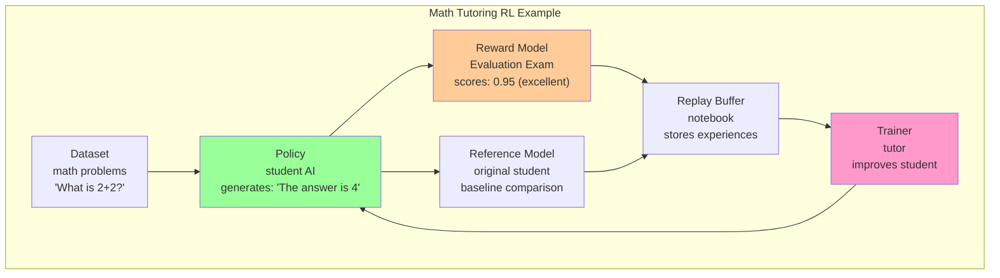
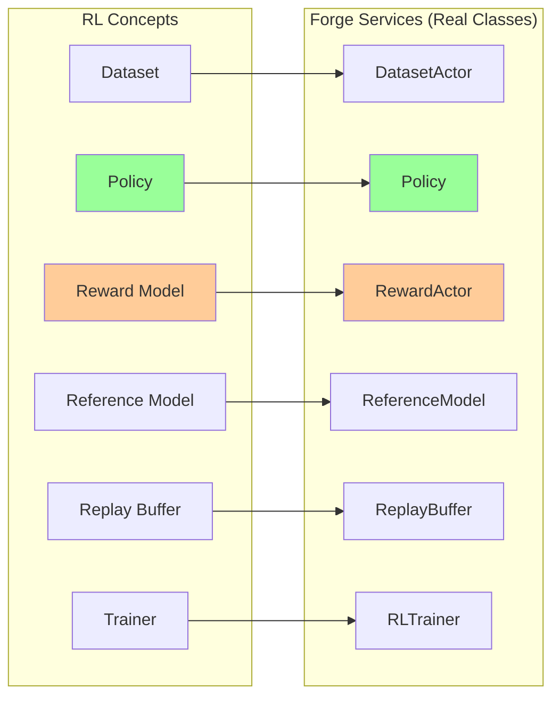
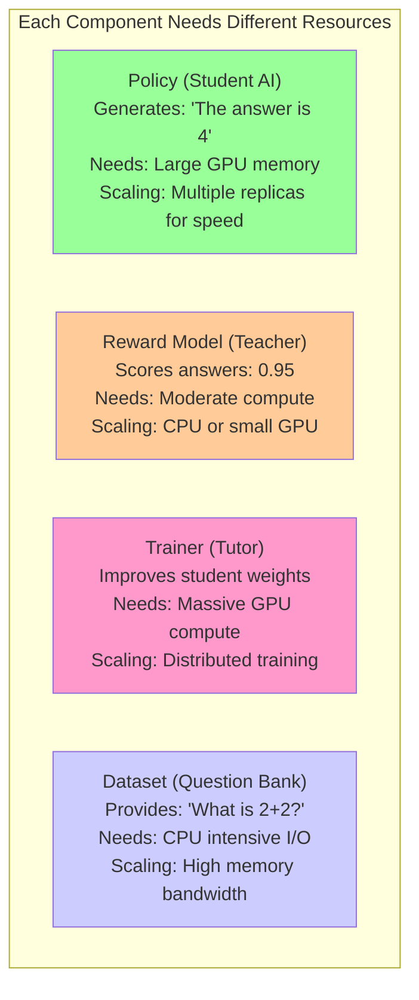
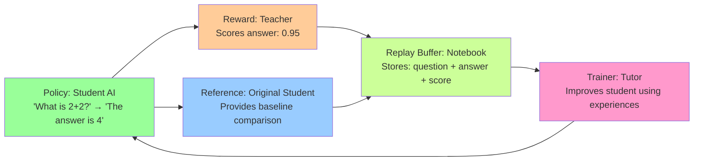

# Part 1: RL Fundamentals - Using Forge Terminology

## Core RL Components in Forge

Let's start with a simple math tutoring example to understand RL concepts with the exact names Forge uses:

### The Toy Example: Teaching Math



### RL Components Defined (Forge Names)

1. **Dataset**: Provides questions/prompts (like "What is 2+2?")
2. **Policy**: The AI being trained (generates answers like "The answer is 4")
3. **Reward Model**: Evaluates answer quality (gives scores like 0.95)
4. **Reference Model**: Original policy copy (prevents drift from baseline)
5. **Replay Buffer**: Stores experiences (question + answer + score)
6. **Trainer**: Updates the policy weights based on experiences

### The RL Learning Flow

```python
# CONCEPTUAL EXAMPLE - see apps/grpo/main.py for GRPO Code

def conceptual_rl_step():
    # 1. Get a math problem
    question = dataset.sample()  # "What is 2+2?"
    
    # 2. Student generates answer  
    answer = policy.generate(question)  # "The answer is 4"
    
    # 3. Teacher grades it
    score = reward_model.evaluate(question, answer)  # 0.95
    
    # 4. Compare to original student
    baseline = reference_model.compute_logprobs(question, answer)
    
    # 5. Store the experience
    experience = Episode(question, answer, score, baseline)
    replay_buffer.add(experience)
    
    # 6. When enough experiences collected, improve student
    batch = replay_buffer.sample(curr_policy_version=0)
    if batch is not None:
        trainer.train_step(batch)  # Student gets better!
        
# 🔄 See complete working example below with actual Forge service calls
```

## From Concepts to Forge Services

Here's the key insight: **Each RL component becomes a Forge service**. The toy example above maps directly to Forge:



### RL Step with Forge Services

Let's look at the example from above again, but this time we would use the names from Forge:

```python
# Conceptual Example

async def conceptual_forge_rl_step(services, step):
    # 1. Get a math problem - CONCEPTUAL API
    sample = await services['dataloader'].get_sample()
    question, target = sample["question"], sample["answer"]
    
    # 2. Student generates answer - CONCEPTUAL API
    # Actual method names vary by implementation
    responses = await services['policy'].generate(prompt=question)
    answer = responses[0].text  
    
    # 3. Teacher grades it - CONCEPTUAL API  
    # Actual reward evaluation varies by implementation
    score = await services['reward_actor'].evaluate(
        prompt=question, response=answer, target=target
    )
    
    # 4. Compare to baseline - CONCEPTUAL API
    ref_logprobs = await services['ref_model'].compute_baseline(responses[0].token_ids)
    
    # 5. Store experience - CONCEPTUAL Episode structure
    # Real Episode structure in src/forge/data_models/episode.py
    episode = create_episode(responses[0], score, ref_logprobs, step)
    await services['replay_buffer'].store(episode)
    
    # 6. Improve student - CONCEPTUAL API
    batch = await services['replay_buffer'].get_batch(policy_version=step)
    if batch is not None:
        loss = await services['trainer'].update_policy(batch)
        return loss
```

**Key difference**: Same RL logic, but each component is now a distributed, fault-tolerant, auto-scaling service.

Did you realise-we are not worrying about any Infra code here! Forge Automagically handles the details behind the scenes and you can focus on writing your RL Algorthms!


## Why This Matters: Traditional ML Infrastructure Fails

### The Infrastructure Challenge

Our simple RL loop above has complex requirements:

#### Problem 1: Different Resource Needs



### Problem 2: Complex Interdependencies



Each step has different:
- **Latency requirements**: Policy inference needs low latency, training can batch
- **Scaling patterns**: Reward evaluation scales with response count, training with model size
- **Failure modes**: Policy failure stops generation, reward failure affects learning quality
- **Resource utilization**: GPUs for inference/training, CPUs for data processing

### Problem 3: The Coordination Challenge

Unlike supervised learning where you process independent batches, RL requires coordination:

```python
# This won't work - creates bottlenecks and resource waste
def naive_rl_step():
    # Policy waits idle while reward model works
    response = policy_model.generate(prompt)  # GPU busy
    reward = reward_model.evaluate(prompt, response)  # Policy GPU idle
    
    # Training waits for single episode  
    loss = compute_loss(response, reward)  # Batch size = 1, inefficient
    
    # Everything stops if any component fails
    if policy_fails or reward_fails or trainer_fails:
        entire_system_stops()
```

## Enter Forge: RL-Native Architecture

Forge solves these problems by treating each RL component as an **independent, scalable service**

Let's see how core RL concepts map to Forge services:

```python
async def real_rl_training_step(services, step):
    """Single RL step using verified Forge APIs"""
    
    # 1. Environment interaction
    sample = await services['dataloader'].__next__.call_one()
    prompt, target = sample["question"], sample["answer"]
    
    responses = await services['policy'].generate.route(prompt=prompt)
    
    # 2. Reward computation
    score = await services['reward_actor'].evaluate_response.route(
        prompt=prompt, response=responses[0].text, target=target
    )
    
    # 3. Get reference logprobs
    ref_logprobs = await services['ref_model'].forward.route(responses[0].token_ids)
    
    # 4. Experience storage - Episode creation pattern
    # Note: Actual Episode structure requires token tensors, not text
    episode = create_episode_from_response(responses[0], score, ref_logprobs, step)
    await services['replay_buffer'].add.call_one(episode)
    
    # 5. Learning - trainer endpoint
    batch = await services['replay_buffer'].sample.call_one(
        curr_policy_version=step
    )
    if batch is not None:
        loss = await services['trainer'].train_step.call_one(batch)
        
        # 6. Policy synchronization - weight update pattern
        await services['trainer'].push_weights.call_one(step + 1)
        await services['policy'].update_weights.fanout(step + 1)
        
        return loss
```

**Key insight**: Each line of RL pseudocode becomes a service call. The complexity of distribution, scaling, and fault tolerance is hidden behind these simple interfaces.

## What Makes This Powerful

### Automatic Resource Management
```python
responses = await policy.generate.route(prompt=question)
answer = responses[0].text  # responses is list[Completion]

# Forge handles behind the scenes:
# - Routing to least loaded replica
# - GPU memory management  
# - Batch optimization
# - Failure recovery
# - Auto-scaling based on demand
```

### Independent Scaling
```python

from forge.actors.policy import Policy, PolicyConfig, SamplingOverrides, WorkerConfig
from forge.actors.replay_buffer import ReplayBuffer
from forge.controller.service import shutdown_service
from apps.grpo.main import Trainer, RewardActor, ComputeAdvantages, RefModel, DatasetActor
from forge.data.rewards import MathReward, ThinkingReward
import asyncio

model = "Qwen/Qwen3-1.7B"
group_size = 1

(
    dataloader,
    policy,
    trainer,
    replay_buffer,
    compute_advantages,
    ref_model,
    reward_actor,
) = await asyncio.gather(
        # Dataset service
        spawn_service(
            ServiceConfig(procs_per_replica=1, num_replicas=1),
            DatasetActor,
            path="openai/gsm8k",
            config_name="main",
            split="train",
            streaming=True,
        ),
        # Policy service with GPU
        spawn_service(
            ServiceConfig(procs_per_replica=1, with_gpus=True, num_replicas=1),
            Policy,
            config=PolicyConfig(
                worker_params=WorkerConfig(model=model),
                sampling_params=SamplingOverrides(
                    num_samples=group_size, max_tokens=16
                ),
            ),
        ),
        # Trainer service with GPU
        spawn_service(
            ServiceConfig(procs_per_replica=1, with_gpus=True, num_replicas=1),
            Trainer,
            learning_rate=1e-5,
            beta=0.1,
            model_name=model,
        ),
        # Replay buffer (CPU)
        spawn_service(
            ServiceConfig(procs_per_replica=1, num_replicas=1),
            ReplayBuffer,
            batch_size=2,
            max_policy_age=1,
        ),
        # Advantage computation (CPU)
        spawn_service(
            ServiceConfig(procs_per_replica=1, num_replicas=1),
            ComputeAdvantages,
            gamma=0.99,
            lambda_=0.95,
        ),
        # Reference model with GPU
        spawn_service(
            ServiceConfig(procs_per_replica=1, num_replicas=1, with_gpus=True),
            RefModel,
            model_name=model,
        ),
        # Reward actor (CPU)
        spawn_service(
            ServiceConfig(procs_per_replica=1, num_replicas=1),
            RewardActor,
            reward_functions=[MathReward(), ThinkingReward()],
        )
    )

# Production scaling - multiply num_replicas:
# Policy: num_replicas=8 for high inference demand
# RewardActor: num_replicas=16 for parallel evaluation
# Trainer: num_replicas=4 for distributed training
```

### Fault Tolerance
```python
# If a policy replica fails:
responses = await policy.generate.route(prompt=question)
answer = responses[0].text
# -> Forge automatically routes to healthy replica
# -> Failed replica respawns in background  
# -> No impact on training loop

# If reward service fails:
score = await reward_actor.evaluate_response.route(
    prompt=question, response=answer, target=target
) 
# -> Retries on different replica automatically
# -> Graceful degradation if all replicas fail
# -> System continues (may need application-level handling)
```

This is fundamentally different from monolithic RL implementations where any component failure stops everything.
