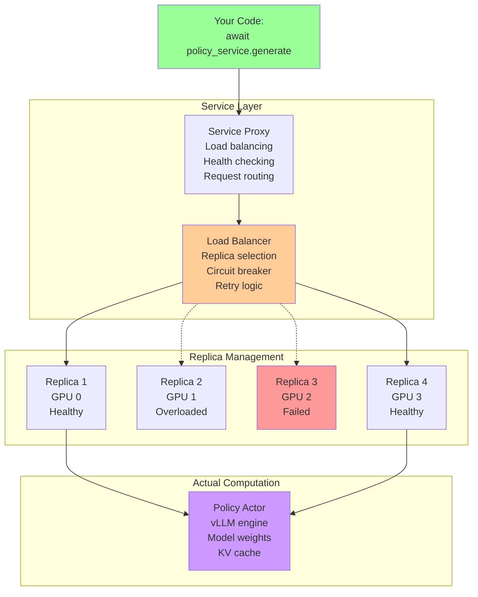
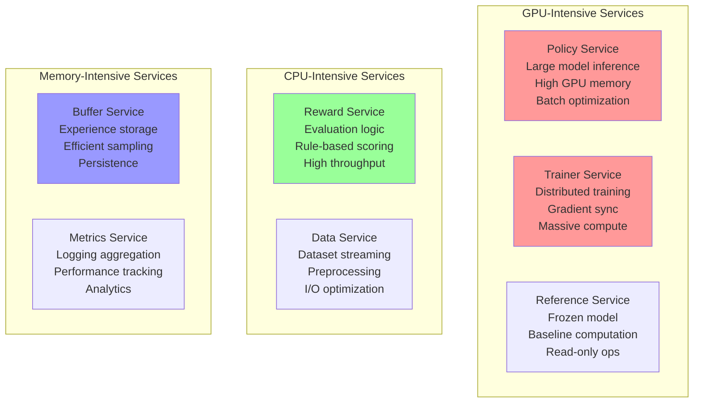

# Part 2: Peeling Back the Abstraction - What Are Services?

We highly recommend reading [Part 1](./1_RL_and_Forge_Fundamentals.MD) before this, it explains RL Concepts and how they land in Forge.

Now that you see the power of the service abstraction, let's understand what's actually happening under the hood, Grab your chai!

## Service Anatomy: Beyond the Interface

When you call `await policy_service.generate(question)`, here's what actually happens:



## Service Components Deep Dive

### 1. Real Service Configuration

Here's the actual ServiceConfig from Forge source code:

```python
# Configuration pattern from apps/grpo/main.py:
Policy.options(
    procs=1,           # Processes per replica
    num_replicas=4,    # Number of replicas  
    with_gpus=True     # Allocate GPUs
    # Other available options:
    # hosts=None
)

# This is the ACTUAL way services are configured in Forge
```

### 2. Real Service Creation

Services are created using the `spawn_service` function:

```python
# This is what ACTUALLY works - copied directly from the notebook

from forge.controller.service import ServiceConfig, spawn_service
from forge.actors.policy import Policy, PolicyConfig, SamplingOverrides, WorkerConfig

model = "Qwen/Qwen3-1.7B"

policy = await spawn_service(
    ServiceConfig(procs_per_replica=1, with_gpus=True, num_replicas=1),
    Policy,
    config=PolicyConfig(
        worker_params=WorkerConfig(model=model),
        sampling_params=SamplingOverrides(
            num_samples=1, max_tokens=16
        ),
    ),
)

prompt = "What is 3 + 5?"
responses = await policy.generate.choose(prompt=prompt)
print(f"Response: {responses[0].text}")

# The spawn_service() function automatically handles:
# - Spawning actor replicas across processes/GPUs
# - Load balancing with .choose() method
# - Health monitoring and failure recovery  
# - Message routing and serialization

# Cleanup when done
await shutdown_service(policy)
```

### 3. How Services Actually Work

Forge services are implemented as ServiceActors that manage collections of your ForgeActor replicas:

```python
# Forge internals - What happens behind the scenes:
# 1. .as_service() creates a ServiceInterface
# 2. ServiceInterface manages N replicas of your ForgeActor class
# 3. ServiceInterface handles routing between replicas
# 4. You get methods like .route(), .fanout(), etc.

# Your code sees this:
responses = await policy.generate.route(prompt=prompt)

# But behind the scenes:
# - ServiceInterface selects healthy replica
# - Routes message to that replica's Policy.generate() endpoint
# - Handles failures and retries automatically
# - Returns list[Completion] from the selected replica
```

### 3. Different Service Types and Their Characteristics



## Deep Dive: Service Communication Patterns

These communication patterns (\"adverbs\") determine how your service calls are routed to replicas. Understanding when to use each pattern is key to effective Forge usage.

### 1. `.route()` - Load Balanced Single Replica

**When to use**: Normal request routing where any replica can handle the request.

```python
responses = await policy.generate.route(prompt=question)
answer = responses[0].text  # Extract text from Completion object

# Behind the scenes:
# 1. Health check eliminates failed replicas
# 2. Load balancer picks least loaded healthy replica  
# 3. Request routes to that specific replica
# 4. Automatic retry on different replica if failure
```

**Performance characteristics**:
- **Latency**: Lowest (single network hop)
- **Throughput**: Limited by single replica capacity
- **Fault tolerance**: Automatic failover to other replicas

**Critical insight**: `.route()` is your default choice for stateless operations in Forge services.

### 2. `.fanout()` - Broadcast with Results Collection

**When to use**: You need responses from ALL replicas.

```python
# Get version from all policy replicas
current_versions = await policy.get_version.fanout()
# Returns: [version_replica_1, version_replica_2, ...] 

# Update weights on all replicas
await policy.update_weights.fanout(new_policy_version)
# Broadcasts to all replicas simultaneously
```

**Performance characteristics**:
- **Latency**: Slowest replica determines total latency
- **Throughput**: Network bandwidth × number of replicas
- **Fault tolerance**: Fails if ANY replica fails (unless configured otherwise)

**Critical gotcha**: Don't use `.fanout()` for high-frequency operations - it contacts all replicas.

### 3. Streaming Operations - Custom Implementation Pattern

**When to use**: You want to process results as they arrive, not wait for all.

```python
# 📝 CONCEPTUAL - Streaming requires custom implementation in your training loop
# The basic ReplayBuffer doesn't have built-in streaming methods
# Pattern from apps/grpo/main.py continuous training:

while training:
    # This is the real API call pattern
    batch = await replay_buffer.sample.call_one(curr_policy_version=step)
    if batch is not None:
        # Process batch immediately
        loss = await trainer.train_step.call_one(batch)
        print(f"Training loss: {loss}")
    else:
        await asyncio.sleep(0.1)  # Wait for more data
```

**Performance characteristics**:
- **Latency**: Process first result immediately  
- **Throughput**: Pipeline parallelism (much higher than sequential)
- **Fault tolerance**: Continues if some replicas fail

**Critical insight**: This is essential for high-throughput RL where you can't wait for batches.

### 4. Fire-and-Forget Operations

**When to use**: Side effects that don't need responses (notifications, cache updates).

```python
# 📝 CONCEPTUAL - Fire-and-forget requires custom @endpoint implementations
# The basic services don't have broadcast methods built-in
# You would implement custom endpoints in your ForgeActor:

class CustomPolicy(Policy):
    @endpoint
    async def clear_cache(self) -> None:
        """Custom endpoint for cache clearing"""
        self.policy_worker.clear_kv_cache()

# Then use it (hypothetical):
# await custom_policy.clear_cache.fanout()  # Clear all replica caches
# Note: Actual cache clearing would use existing Policy methods
```

**Performance characteristics**:
- **Latency**: Immediately returns (doesn't wait for completion)
- **Throughput**: Network limited, but non-blocking
- **Fault tolerance**: Fire-and-forget (you don't know if it worked)

**Critical warning**: Only use for non-critical operations - you get no confirmation.

### 5. Service Sessions for Stateful Operations

**When to use**: When you need multiple calls to hit the same replica (like KV cache preservation).

```python
# This Counter example demonstrates the session pattern

from forge.controller import ForgeActor
from forge.controller.service import ServiceConfig, spawn_service, shutdown_service
from monarch.actor import endpoint

class ForgeCounter(ForgeActor):
    def __init__(self, initial_value: int):
        self.value = initial_value

    @endpoint
    def increment(self) -> int:
        self.value += 1
        return self.value

    @endpoint
    def get_value(self) -> int:
        return self.value

    @endpoint
    async def reset(self):
        self.value = 0

counter_service = await spawn_service(
    ServiceConfig(procs_per_replica=1, num_replicas=4),
    ForgeCounter,
    initial_value=0
)

# Test basic operations
await counter_service.increment.choose()
results = await counter_service.increment.call()
print(f"All replica values: {results}")

# STICKY SESSIONS
print("\nUsing sticky sessions:")
async with counter_service.session():
    await counter_service.reset.choose()
    print(await counter_service.increment.choose())  # 1
    print(await counter_service.increment.choose())  # 2
    print(await counter_service.increment.choose())  # 3
          
    final_value = await counter_service.get_value.choose()
    print(f"Final value on this replica: {final_value}")  # 3

# Same pattern works with Policy for multi-turn conversations:
# async with policy.session():
#     response1 = await policy.generate.choose(prompt=turn1)
#     full_prompt = turn1 + response1[0].text + turn2
#     response2 = await policy.generate.choose(prompt=full_prompt)
#     # Both calls hit same replica, preserving KV cache

# Cleanup
await shutdown_service(counter_service)
```

**Performance impact**: Critical for maintaining KV cache in multi-turn conversations.

## Deep Dive: State Management Reality

The most complex challenge in distributed RL is maintaining state consistency while maximizing performance.

### The KV Cache Problem  

**The challenge**: Policy inference is much faster with KV cache, but cache is tied to specific conversation history.

```python
# This breaks KV cache optimization:
async def naive_multi_turn():
    # Each call might go to different replica = cache miss
    response1 = await policy_service.generate.choose(question1)
    response2 = await policy_service.generate.choose(question1 + response1) # Cache miss!
    response3 = await policy_service.generate.choose(conversation_so_far)   # Cache miss!
```

**The solution**: Sticky sessions ensure all calls go to same replica.

```python  
async def optimized_multi_turn():
    async with policy.session():
        # All calls guaranteed to hit same replica = cache hits
        response1 = await policy.generate.route(prompt=question1)
        full_prompt = question1 + response1[0].text  
        response2 = await policy.generate.route(prompt=full_prompt) # Cache hit!
        conversation = full_prompt + response2[0].text
        response3 = await policy.generate.route(prompt=conversation)   # Cache hit!
        
    # Session ends, replica can be garbage collected or reused
```

**Performance impact**: Maintaining KV cache across turns avoids recomputing previous tokens.

### Replay Buffer Consistency

**The challenge**: Multiple trainers and experience collectors reading/writing concurrently.

**Real Forge approach**: The ReplayBuffer actor handles concurrency internally:

```python
# Forge ReplayBuffer endpoints (verified from source code)
# Add episodes (thread-safe by actor model)
await replay_buffer.add.call_one(episode)  # Note: .call_one() not .choose()

# Sample batches for training
batch = await replay_buffer.sample.call_one(
    curr_policy_version=step_number,
    batch_size=None  # Optional parameter, uses default from config
)

# Additional methods available:
# await replay_buffer.clear.call_one()  # Clear buffer
# await replay_buffer.evict.call_one(curr_policy_version)  # Remove old episodes
# state = await replay_buffer.state_dict.call_one()  # Get state for checkpointing
```

**Critical insight**: The actor model provides natural thread safety - each actor processes messages sequentially.

### Weight Synchronization Strategy

**The challenge**: Trainer updates policy weights, but policy service needs those weights.

```python
# Forge weight synchronization pattern from apps/grpo/main.py
async def real_weight_sync(trainer, policy, step):
    # Trainer pushes weights to TorchStore with version number
    await trainer.push_weights.call_one(policy_version=step + 1)
    
    # Policy service updates to new version from TorchStore  
    # Use .fanout() to update ALL policy replicas
    await policy.update_weights.fanout(policy_version=step + 1)
    
# Check current policy version
current_version = await policy.get_version.route()
print(f"Current policy version: {current_version}")
```

## Deep Dive: Asynchronous Coordination Patterns

**The real challenge**: Different services run at different speeds, but Forge's service abstraction handles the coordination complexity.

### The Forge Approach: Let Services Handle Coordination

Instead of manual coordination, Forge services handle speed mismatches automatically:

```python

from apps.grpo.main import Episode, Group

async def simple_rl_step():
    
    # ===== Generate a rollout =====
    sample = await dataloader.__next__.choose()
    prompt, target = sample["question"], sample["answer"]
    
    print(f"Prompt: {prompt}")
    print(f"Target: {target}")
    
    actions = await policy.generate.choose(prompt=prompt)
    print(f"Policy response: {actions[0].text}")
    
    ref_logprobs = await ref_model.forward.choose(actions[0].token_ids)    
    reward = await reward_actor.evaluate_response.choose(
        prompt=prompt, 
        response=actions[0].text, 
        target=target
    )
    print(f"Reward: {reward}")
    
    episode = Episode(
        episode_id=0,
        prompt=prompt,
        target=target, 
        policy_version=0,
    )
    
    episode.add_group(Group(
        response=actions[0].text,
        ref_logprobs=ref_logprobs,
        reward=reward,
    ))
    
    advantages = await compute_advantages.__call__.choose(episode.groups)
    episode.groups[0].advantage = advantages[0]
    print(f"Advantage: {advantages[0]}")    
    await replay_buffer.add.choose(episode)
    print("Episode stored in replay buffer")
    
    # ===== Train on the batch ===== 
    batch = await replay_buffer.sample.choose(curr_policy_version=0)
    if batch is not None:
        print("Training on batch...")
        training_result = await trainer.train_step.choose(batch)
        loss = training_result.get("loss", 0.0)
        print(f"Training loss: {loss}")
        return loss
    else:
        print("Not enough data in buffer yet")
        return None

for step in range(10):
    print(f"\n--- RL Step {step + 1} ---")
    loss = await simple_rl_step()
    if loss:
        print(f"Step {step + 1} complete, loss: {loss:.4f}")
    else:
        print(f"Step {step + 1} complete, building buffer...")
```

### Handling Speed Mismatches with Service Scaling

**The insight**: Scale services independently based on their bottlenecks.

```python
# Scale fast services with more replicas
policy = await Policy.options(
    procs=1, num_replicas=8, with_gpus=True  # Many replicas for high throughput
).as_service(
    engine_config=EngineConfig(model=model_name)
)

# Reward evaluation might be CPU-bound
reward_actor = await RewardActor.options(
    procs=1, num_replicas=16, with_gpus=False  # More CPU replicas
).as_service(
    reward_functions=[MathReward()]
)

# Training needs fewer but more powerful replicas
trainer = await RLTrainer.options(
    procs=1, num_replicas=2, with_gpus=True  # Fewer but GPU-heavy
).as_actor(  # Trainer typically uses .as_actor() not .as_service()
    optimizer=Optimizer(lr=1e-5)
)
```

### Natural Backpressure Through Service APIs

```python
# backpressure pattern - The replay buffer naturally provides backpressure
batch = await replay_buffer.sample.call_one(curr_policy_version=step)
if batch is None:
    # Not enough data yet - natural rate limiting
    print("Buffer not ready, collecting more experiences...")
    continue
else:
    # Proceed with training
    loss = await trainer.train_step.call_one(batch)
    print(f"Training loss: {loss}")
```

These patterns address the core technical challenges in distributed RL. The key insight: **Forge services handle coordination complexity automatically, letting you focus on RL algorithm logic**.

## Service Implementation Example

Let's see how a reward service is actually implemented:

```python
# ✅ COMPLETE WORKING EXAMPLE - Exact RewardActor from apps/grpo/main.py

from forge.controller import ForgeActor
from monarch.actor import endpoint
from forge.data.rewards import MathReward, ThinkingReward
from forge.controller.service import ServiceConfig, spawn_service

# EXACT class definition from apps/grpo/main.py lines 68-83  
class RewardActor(ForgeActor):
    def __init__(self, reward_functions: list):
        self.reward_functions = reward_functions

    @endpoint
    async def evaluate_response(self, prompt: str, response: str, target: str) -> float:
        """Evaluate response quality using multiple reward functions"""
        total_reward = 0.0
        
        for reward_fn in self.reward_functions:
            # Each reward function contributes to total score
            reward = reward_fn(prompt, response, target)
            total_reward += reward
            
        # Return average reward across all functions
        return total_reward / len(self.reward_functions) if self.reward_functions else 0.0

reward_actor = await spawn_service(
    ServiceConfig(procs_per_replica=1, num_replicas=1),
    RewardActor,
    reward_functions=[MathReward(), ThinkingReward()]
)

prompt = "What is 15% of 240?"
response = "15% of 240 is 36"
target = "36"

score = await reward_actor.evaluate_response.choose(
    prompt=prompt,
    response=response, 
    target=target
)
print(f"Reward score: {score}")  # Usually around 1.0 for correct math answers

# For production scaling - increase num_replicas for parallel evaluation:
# ServiceConfig(procs_per_replica=1, num_replicas=16)  # 16 parallel evaluators

# Cleanup when done
await shutdown_service(reward_actor)
```

## Service Orchestration: The Training Loop

Now let's see how services coordinate in a real training loop:

```python
# This is the REAL way production RL systems are built with Forge

import asyncio
from forge.actors.policy import Policy
from forge.actors.reference_model import ReferenceModel
from forge.actors.replay_buffer import ReplayBuffer
from forge.actors.trainer import RLTrainer
from forge.controller.actor import ForgeActor
from forge.data.rewards import MathReward, ThinkingReward
from monarch.actor import endpoint
from omegaconf import DictConfig

# EXACT service creation from apps/grpo/main.py lines 322-344
print("Initializing all services...")
(
    dataloader,
    policy,
    trainer,
    replay_buffer,
    compute_advantages,
    ref_model,
    reward_actor,
) = await asyncio.gather(
    DatasetActor.options(**cfg.actors.dataset).as_actor(**cfg.dataset),
    Policy.options(**cfg.services.policy).as_service(**cfg.policy),
    RLTrainer.options(**cfg.actors.trainer).as_actor(
        **cfg.trainer, loss=simple_grpo_loss
    ),
    ReplayBuffer.options(**cfg.actors.replay_buffer).as_actor(
        **cfg.replay_buffer, collate=collate
    ),
    ComputeAdvantages.options(**cfg.actors.compute_advantages).as_actor(),
    ReferenceModel.options(**cfg.services.ref_model).as_service(**cfg.ref_model),
    RewardActor.options(**cfg.services.reward_actor).as_service(
        reward_functions=[MathReward(), ThinkingReward()]
    ),
)

print("All services initialized successfully!")

# EXACT usage patterns from apps/grpo/main.py continuous training loop
async def production_training_loop():
    """Real training loop pattern from apps/grpo/main.py"""
    step = 0
    
    while True:
        # Data generation 
        sample = await dataloader.sample.call_one()
        
        # Policy generation service call
        responses = await policy.generate.route(prompt=sample["question"])
        
        # Reference computation service call
        ref_logprobs = await ref_model.forward.route(responses[0].token_ids)
        
        # Reward evaluation service call 
        reward = await reward_actor.evaluate_response.route(
            prompt=sample["question"],
            response=responses[0].text,
            target=sample["answer"]
        )
        
        # Experience storage (simplified structure for illustration)
        episode = create_episode(sample, responses[0], reward, ref_logprobs, step)
        await replay_buffer.add.call_one(episode)
        
        # Training when ready endpoints
        batch = await replay_buffer.sample.call_one(curr_policy_version=step)
        if batch is not None:
            loss = await trainer.train_step.call_one(batch)
            
            # Weight synchronization pattern
            await trainer.push_weights.call_one(step + 1)
            await policy.update_weights.route(step + 1)
            
            print(f"Step {step}, Loss: {loss:.4f}")
            step += 1

# EXACT cleanup pattern from apps/grpo/main.py lines 493-504  
print("Shutting down services...")
await asyncio.gather(
    DatasetActor.shutdown(dataloader),
    policy.shutdown(),
    RLTrainer.shutdown(trainer),
    ReplayBuffer.shutdown(replay_buffer),
    ComputeAdvantages.shutdown(compute_advantages),
    ref_model.shutdown(),
    reward_actor.shutdown(),
)
print("All services shut down successfully!")
```

**Key observations:**
1. **Parallelism**: Independent operations run concurrently
2. **Load balancing**: Each `choose()` call automatically selects optimal replica  
3. **Fault tolerance**: Failures automatically retry on different replicas
4. **Resource efficiency**: CPU and GPU services scale independently
5. **Coordination**: Services coordinate through shared state (replay buffer, weight versions)

This is the power of the service abstraction - complex distributed coordination looks like simple async Python code.
