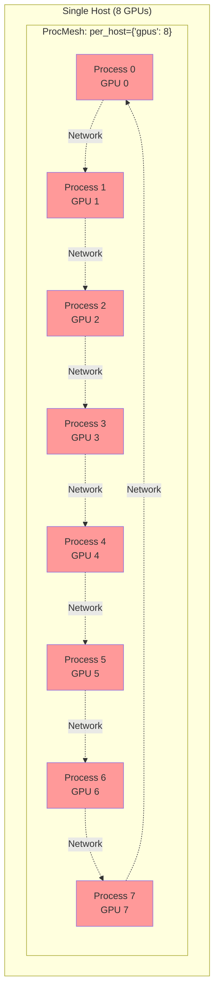
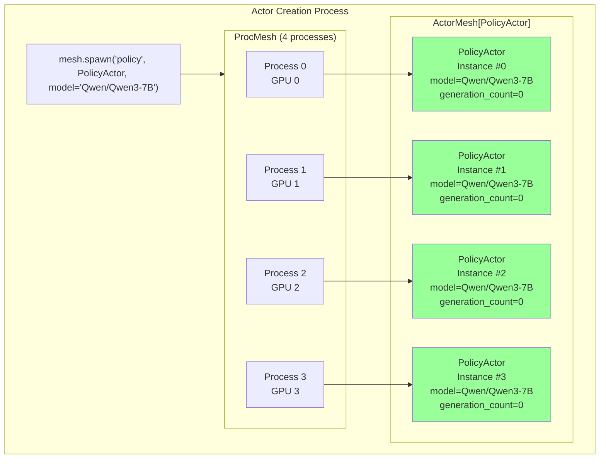
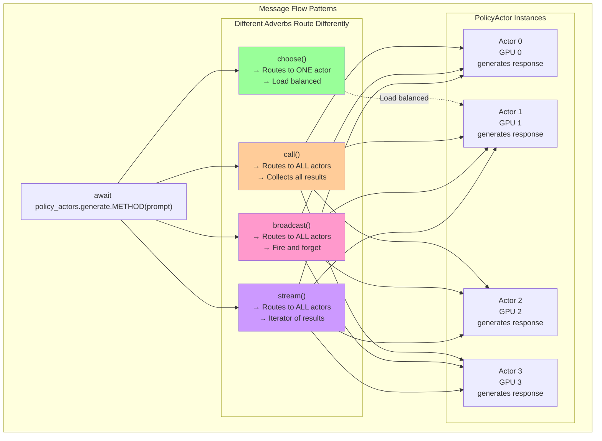

# Part 3: The Forge-Monarch Connection

This is part 3 of our series, in the previous sections: we learned [RL Concepts and how they map to Forge](./1_RL_and_Forge_Fundamentals.MD), [Forge Internals](./2_Forge_Internals.MD).

Now let's peel back the layers. Forge services are built on top of **Monarch**, PyTorch's distributed actor framework. Understanding this connection is crucial for optimization and debugging.

## The Complete Hierarchy: Service to Silicon

```mermaid
graph TD
    subgraph YourCode["1. Your RL Code"]
        Call["await policy_service.generate.choose('What is 2+2?')"]
    end
    
    subgraph ForgeServices["2. Forge Service Layer"]
        ServiceInterface["ServiceInterface<br/>• Routes .choose() to replica<br/>• Handles load balancing<br/>• Manages health checks"]
        ServiceActor["ServiceActor<br/>• Manages replica lifecycle<br/>• Monitors health<br/>• Coordinates failures"]
    end
    
    subgraph MonarchLayer["3. Monarch Actor Layer"]  
        ActorMesh["ActorMesh[PolicyActor]<br/>• 4 PolicyActor instances<br/>• Each on different GPU<br/>• Message passing interface"]
        ProcMesh["ProcMesh<br/>• 4 processes<br/>• GPU topology: [0,1,2,3]<br/>• Network interconnect"]
    end
    
    subgraph Hardware["4. Physical Hardware"]
        GPU0["GPU 0<br/>PolicyActor #1<br/>vLLM Engine<br/>Model Weights"]
        GPU1["GPU 1<br/>PolicyActor #2<br/>vLLM Engine<br/>Model Weights"] 
        GPU2["GPU 2<br/>PolicyActor #3<br/>vLLM Engine<br/>Model Weights"]
        GPU3["GPU 3<br/>PolicyActor #4<br/>vLLM Engine<br/>Model Weights"]
    end
    
    Call --> ServiceInterface
    ServiceInterface --> ServiceActor
    ServiceActor --> ActorMesh
    ActorMesh --> ProcMesh
    ProcMesh --> GPU0
    ProcMesh --> GPU1
    ProcMesh --> GPU2
    ProcMesh --> GPU3
    
    style Call fill:#99ff99
    style ServiceActor fill:#ffcc99
    style ActorMesh fill:#cc99ff
    style ProcMesh fill:#ccccff
```

## Deep Dive: ProcMesh - The Foundation

**ProcMesh** is Monarch's core abstraction for organizing processes across hardware. Think of it as a multi-dimensional grid that maps directly to your cluster topology.

### Single Host ProcMesh



### Multi-Host ProcMesh

```mermaid
graph TD
    subgraph Cluster["Multi-Host Cluster"]
        subgraph Host1["Host 1"]
            subgraph PM1["ProcMesh Segment 1"]
                H1P0["Process 0<br/>GPU 0"]
                H1P1["Process 1<br/>GPU 1"]
                H1P2["Process 2<br/>GPU 2"]
                H1P3["Process 3<br/>GPU 3"]
            end
        end
        
        subgraph Host2["Host 2"] 
            subgraph PM2["ProcMesh Segment 2"]
                H2P0["Process 4<br/>GPU 0"]
                H2P1["Process 5<br/>GPU 1"]
                H2P2["Process 6<br/>GPU 2"]
                H2P3["Process 7<br/>GPU 3"]
            end
        end
        
        subgraph Host3["Host 3"]
            subgraph PM3["ProcMesh Segment 3"]
                H3P0["Process 8<br/>GPU 0"]
                H3P1["Process 9<br/>GPU 1"]
                H3P2["Process 10<br/>GPU 2"] 
                H3P3["Process 11<br/>GPU 3"]
            end
        end
    end
    
    H1P0 -.->|"InfiniBand"| H2P0
    H1P1 -.->|"InfiniBand"| H2P1
    H2P0 -.->|"InfiniBand"| H3P0
    H2P1 -.->|"InfiniBand"| H3P1
    
    style PM1 fill:#ff9999
    style PM2 fill:#99ff99
    style PM3 fill:#99ccff
```

```python
# This shows the underlying actor system that powers Forge services

from monarch.actor import Actor, endpoint, this_proc, Future
from monarch.actor import ProcMesh, this_host
import asyncio

# STEP 1: Define a basic actor
class Counter(Actor):
    def __init__(self, initial_value: int):
        self.value = initial_value

    @endpoint
    def increment(self) -> None:
        self.value += 1

    @endpoint
    def get_value(self) -> int:
        return self.value

# STEP 2: Single actor in local process
counter: Counter = this_proc().spawn("counter", Counter, initial_value=0)

# STEP 3: Send messages
fut: Future[int] = counter.get_value.call_one()
value = await fut
print(f"Counter value: {value}")  # 0

# STEP 4: Multiple actors across processes
procs: ProcMesh = this_host().spawn_procs(per_host={"gpus": 8})
counters: Counter = procs.spawn("counters", Counter, 0)

# STEP 5: Broadcast to all actors
await counters.increment.call()

# STEP 6: Different message patterns
# call_one() - single actor
value = await counters.get_value.call_one()
print(f"One counter: {value}")

# choose() - random single actor  
value = await counters.get_value.choose()
print(f"Random counter: {value}")

# call() - all actors, collect results
values = await counters.get_value.call()
print(f"All counters: {values}")

# broadcast() - fire and forget
await counters.increment.broadcast()

# Cleanup
await procs.stop()
```

## Actor Meshes: Your Code Running Distributed

**ActorMesh** is created when you spawn actors across a ProcMesh. Each process in the ProcMesh gets one instance of your actor.



### Message Routing Through ActorMesh



## How Forge Services Use Monarch

Now the key insight: **Forge services are ServiceActors that manage ActorMeshes of your ForgeActor replicas**.

### The Service Creation Process

```mermaid
graph TD
    subgraph ServiceCreation["spawn_service() Process"]
        Call["await spawn_service(ServiceConfig(num_replicas=4), PolicyActor, model='Qwen')"]
        
        ServiceActor["ServiceActor<br/>• Manages 4 replicas<br/>• Handles health checks<br/>• Routes service calls"]
        
        subgraph Replicas["4 Independent Replicas"] 
            subgraph R0["Replica 0"]
                PM0["ProcMesh<br/>1 process<br/>GPU 0"]
                AM0["ActorMesh<br/>1 PolicyActor"]
            end
            
            subgraph R1["Replica 1"]
                PM1["ProcMesh<br/>1 process<br/>GPU 1"] 
                AM1["ActorMesh<br/>1 PolicyActor"]
            end
            
            subgraph R2["Replica 2"]
                PM2["ProcMesh<br/>1 process<br/>GPU 2"]
                AM2["ActorMesh<br/>1 PolicyActor"]
            end
            
            subgraph R3["Replica 3"]
                PM3["ProcMesh<br/>1 process<br/>GPU 3"]
                AM3["ActorMesh<br/>1 PolicyActor"]
            end
        end
        
        Call --> ServiceActor
        ServiceActor --> R0
        ServiceActor --> R1
        ServiceActor --> R2
        ServiceActor --> R3
        PM0 --> AM0
        PM1 --> AM1
        PM2 --> AM2
        PM3 --> AM3
    end
    
    style ServiceActor fill:#ffcc99
    style AM0 fill:#99ff99
    style AM1 fill:#99ff99
    style AM2 fill:#99ff99
    style AM3 fill:#99ff99
```

### Service Call to Actor Execution

```mermaid
graph TD
    subgraph CallFlow["Complete Call Flow"]
        UserCall["await policy_service.generate.choose('What is 2+2?')"]
        
        ServiceInterface["ServiceInterface<br/>• Receives .choose() call<br/>• Routes to ServiceActor"]
        
        ServiceActor["ServiceActor<br/>• Selects healthy replica<br/>• Load balancing logic<br/>• Failure handling"]
        
        SelectedReplica["Selected Replica #2<br/>• ProcMesh with 1 process<br/>• ActorMesh with 1 PolicyActor"]
        
        PolicyActor["PolicyActor Instance<br/>• Loads model<br/>• Runs vLLM inference<br/>• Returns 'The answer is 4'"]
        
        GPU["GPU 2<br/>• vLLM engine<br/>• Model weights<br/>• KV cache<br/>• CUDA kernels"]
        
        UserCall --> ServiceInterface
        ServiceInterface --> ServiceActor
        ServiceActor --> SelectedReplica
        SelectedReplica --> PolicyActor
        PolicyActor --> GPU
        
        GPU -.->|"Response"| PolicyActor
        PolicyActor -.->|"Response"| SelectedReplica
        SelectedReplica -.->|"Response"| ServiceActor
        ServiceActor -.->|"Response"| ServiceInterface
        ServiceInterface -.->|"'The answer is 4'"| UserCall
    end
    
    style UserCall fill:#99ff99
    style ServiceActor fill:#ffcc99
    style PolicyActor fill:#cc99ff
    style GPU fill:#ffcccc
```



## Multiple Services Sharing Infrastructure

In real RL systems, you have multiple services that can share or use separate ProcMeshes:

```mermaid
graph TD
    subgraph Cluster["RL Training Cluster"]
        subgraph Services["Forge Services"] 
            PS["Policy Service<br/>4 GPU replicas"]
            TS["Trainer Service<br/>2 GPU replicas"] 
            RS["Reward Service<br/>4 CPU replicas"]
            BS["Buffer Service<br/>1 CPU replica"]
        end
        
        subgraph MonarchInfra["Monarch Infrastructure"]
            subgraph GPUMesh["GPU ProcMesh (6 processes)"]
                G0["Process 0<br/>GPU 0"]
                G1["Process 1<br/>GPU 1"]
                G2["Process 2<br/>GPU 2"] 
                G3["Process 3<br/>GPU 3"]
                G4["Process 4<br/>GPU 4"]
                G5["Process 5<br/>GPU 5"]
            end
            
            subgraph CPUMesh["CPU ProcMesh (5 processes)"]
                C0["Process 0<br/>CPU"]
                C1["Process 1<br/>CPU"] 
                C2["Process 2<br/>CPU"]
                C3["Process 3<br/>CPU"]
                C4["Process 4<br/>CPU"]
            end
        end
        
        PS --> G0
        PS --> G1
        PS --> G2
        PS --> G3
        TS --> G4
        TS --> G5
        RS --> C0
        RS --> C1
        RS --> C2
        RS --> C3
        BS --> C4
    end
    
    style PS fill:#99ff99
    style TS fill:#ff99cc
    style RS fill:#ffcc99
    style BS fill:#cc99ff
    style GPUMesh fill:#ffe6e6
    style CPUMesh fill:#e6f3ff
```

## Key Insights: Why This Architecture Matters

1. **Process Isolation**: Each actor runs in its own process - failures don't cascade
2. **Location Transparency**: Actors can be local or remote with identical APIs  
3. **Structured Distribution**: ProcMesh maps directly to hardware topology
4. **Message Passing**: No shared memory means no race conditions or locks
5. **Service Abstraction**: Forge hides Monarch complexity while preserving power

Understanding this hierarchy helps you:
- **Debug performance issues**: Is the bottleneck at service, actor, or hardware level?
- **Optimize resource usage**: How many replicas per service? GPU vs CPU processes?
- **Handle failures gracefully**: Which layer failed and how to recover?
- **Scale effectively**: Where to add resources for maximum impact?

# Conclusion

## What You've Learned

1. **RL Fundamentals**: How RL concepts map to Forge services with REAL, working examples
2. **Service Abstraction**: How to use Forge services effectively with verified communication patterns  
3. **Monarch Foundation**: How Forge services connect to distributed actors and hardware

## Key Takeaways

- **Services hide complexity**: Your RL code looks like simple async functions, but runs on distributed clusters
- **Communication patterns matter**: `.route()`, `.fanout()`, sessions, and `.call_one()` each serve specific purposes  
- **Architecture understanding helps**: Knowing the Service → Actor → Process → Hardware hierarchy helps you debug, optimize, and scale
- **Always verify APIs**: This guide is verified, but cross-check with source code for latest changes
- **Real API patterns**: Use `.options().as_service()` not `spawn_service()`, use `.route()` not `.choose()`, etc.
